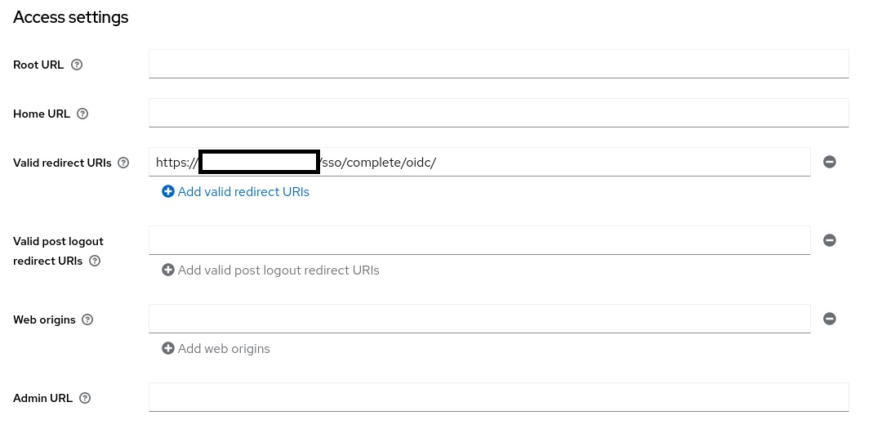
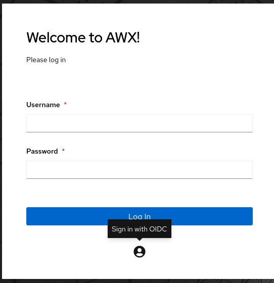

---
author: IDerr
title: Connect your AWX/Ansible Tower with Keycloak !  
date: 2022-11-04
description: Connect your AWX/Ansible Tower with Keycloak  !
image: "background.jpg"
categories: 
    - "Keycloak"
    - "AWX"
    - "Ansible Tower"
tags:
    - Keycloak
    - AWX
    - Ansible Tower
---

## Introduction

Want to connect your AWX/Ansible Tower with your SSO solution (thanks to openid connect), in my case keycloak, you're in the right place.
I have seen a lot of tutorials on how to configure with SAML, but not one with OIDC so here it is :)
## Prerequisites

- A keycloak
- An ansible tower / awx

If you respect all these prerequisites, you are good to go !

## Tutorial 
Go to your beautiful keycloak instance 
Add a client in keycloak with this redirect url 
https://<AWX_HOST>/sso/complete/oidc/
Something like this :

Get your keys in your credentials part (if not set, set it to Client ID and secret)

In your awx/tower instance, go to settings, generic oidc and fill all the infos :
OIDC key : Keycloak's client id 
OIDC secret : Keycloak's client secret 
OIDC provider : https://<KEYCLOAK_HOST>/realms/<YOUR_REALM>

## Conclusion

Only that, yes.

Your awx/ansible tower is now connected, login and do as you please! 

See you on the next article !