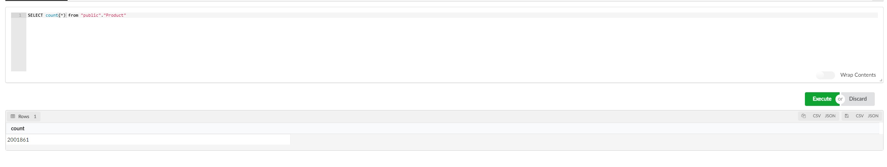

## Introduction
Today we will discuss how to import OpenFoodFacts data from their CSV to a PostgreSQL Database.

I wanted to work on OpenFoodFacts data, but never found MongoDB really great to work with, so I decided to migrate the CSV Data to Postgres, and clean the database (and give back a bit to this awesome community)

You can find all my work on my Github : https://github.com/IDerr/Openfoodfacts

## How to download OpenFoodFacts data 

OpenFoodFacts provides all their data for free on their website, with three different formats: Json (based on their mongodb database), CSV and RDF
You can download al the data on their website: https://openfoodfacts.org/data

For the sake of simplicity, I'll use the CSV format for my project.

## How to import data from the CSV to PostgreSQL

As I said, I'll store my data on PostgreSQL, I think this is a great way to store linked data like this (A graph database would be a good fit also), it'll enforce that all fields are filled and the schema respected.

I took the CSV file, checked all the columns available, and went with a simple schema (still can be improved :D).

I have determined 12 Models (Additives, Allergens, Brand, Category, City, Country, Emb, Label, Package, Product, Store, Trace) and a bunch of Pivot tables for many to many relations.

To implement models files, I used [SQLAlchemy](https://www.sqlalchemy.org/) to create my database schema programmatically, so I can reuse those models files if I want to interact with the database.

A small python script to parse the CSV, remove incorrect data (same barcode on multiple products ?), and create the product with full links, and tada, we have our database with a lot of products!

## Next steps
Now that our database is ready, there is still work that can be done.
The fist step I see is cleaning possible errors or inconsistent data.
We have multiple ways to analyse the database to find these errors:
  - Use the CSV with some Python to detect anomalies (Pandas + some code)
  - Use SQL to find anomalies (or again use Pandas with SQL as a backend)

After that part, we can make an API based on the models we created before, to integrate the database with our applications! 

Finally, finding ways to improve our database, translations, ingredients, score and so on!

## Conclusion

I'll continue working this project on my side, if anyone would like to help me on this project, feel free to create issues and PR on the github repository.
I am also available on Openfoodfacts Slack (IDerr), if there's any questions!

If anyone from openfoodfacts is interested on merging the work I am doing on the public database, don't hesitate! 
See you next week for the next article (on OpenFoodFacts)! 