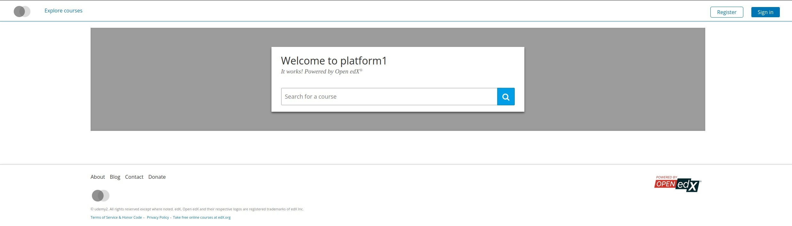

# Introduction

Today, we will discuss how to use Tutor for deploying OpenEdx.
OpenEdx is a platform used to deploy your courses online, it's an Udemy like but self hosted.

Tutor is an amazing tool to get it deployed with Docker (or Kubernetes).

# Installation
## Tutor installation

Installation is really straightforward, a simple binary to download and you're done !

```bash
sudo curl -L "https://github.com/overhangio/tutor/releases/download/v12.1.6/tutor-$(uname -s)_$(uname -m)" -o /usr/local/bin/tutor
sudo chmod 0755 /usr/local/bin/tutor
```
Shamefully copied/pasted from the [documentation](https://docs.tutor.overhang.io/install.html)

Really simple, no ?

## Run your environnement
Now that we have Tutor installed in our environnement, we can launch our platform with the following command 
```
tutor local quickstart
```
You'll be asked some questions to change some variables : 
 - Is it a production platform ?
 - Our instance name
 - Our contact email

For this tutorial, I'll run a non production openedx.

```bash
iderr@iderr-VirtualBox:~$ tutor local quickstart

==================================================

        Interactive platform configuration

==================================================

Are you configuring a production platform? Type 'n' if you are just testing Tutor on your local computer [Y/n] n

As you are not running this platform in production, we automatically set the following configuration values:

    LMS_HOST = local.overhang.io

    CMS_HOST = studio.local.overhang.io

    ENABLE_HTTPS = False

Your platform name/title [My Open edX] platform1       

Your public contact email address [contact@local.overhang.io] 

The default language code for the platform [en] 

Configuration saved to /home/iderr/.local/share/tutor/config.yml

Environment generated in /home/iderr/.local/share/tutor/env
```
We let tutor do its job, and your environnement will be ready after seeing a text message like this
```
All services initialised.

The Open edX platform is now running in detached mode

Your Open edX platform is ready and can be accessed at the following urls:
    http://local.overhang.io
    http://studio.local.overhang.io
```

For our test, I'll stick with defaults urls, of course, you can use yours.
I'll modify my /etc/hosts file to redirect urls in my localhost environnement
```
127.0.0.1	localhost local.overhang.io studio.local.overhang.io
```
TADA


## Conclusion

Congratulations, now, we have a running OpenEdx installation ! 
See you next time for the configuration of OpenEdx and its customisation ! 